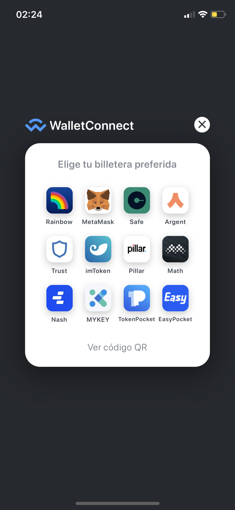
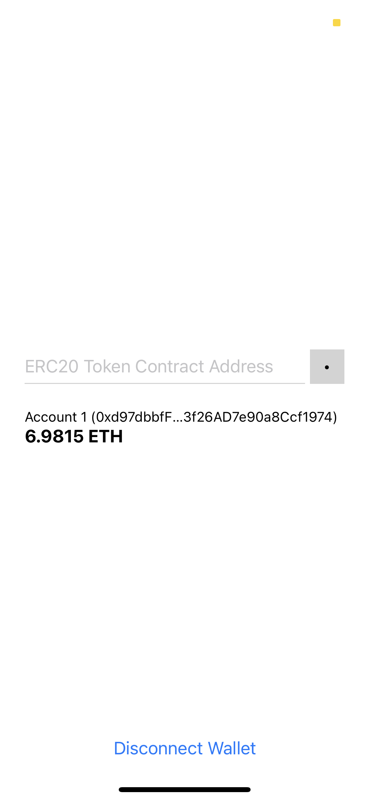
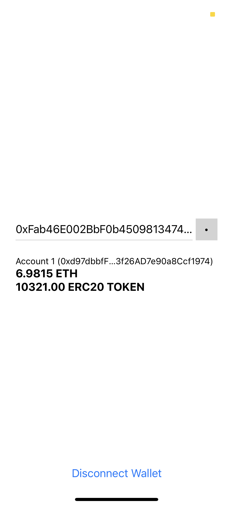

# Expo Ethereum Token Balance Poc

Simple React Native Expo App PoC for getting token balances from an Ethereum wallet address. For this PoC we are using the Kovan testnet, but it is easily changeable for another testnet or even the mainnet.

## Prerequisites

- Expo CLI
- A mobile Ethereum wallet that is supported by WalletConnect (https://walletconnect.org/wallets) installed on your running device

## How to run

```
yarn install
expo start
```

## Screenshots






## Enjoy! :)

Any comment, question or suggestion? Feel free to file an issue, open a pull request or send me a tweet to @briansztamfater and I'll catch up as soon as I can.
